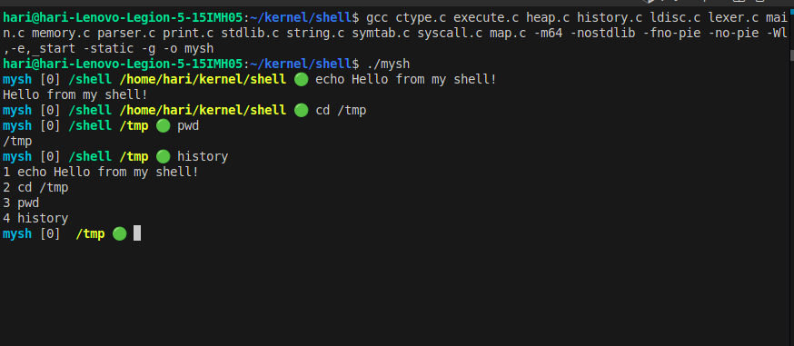
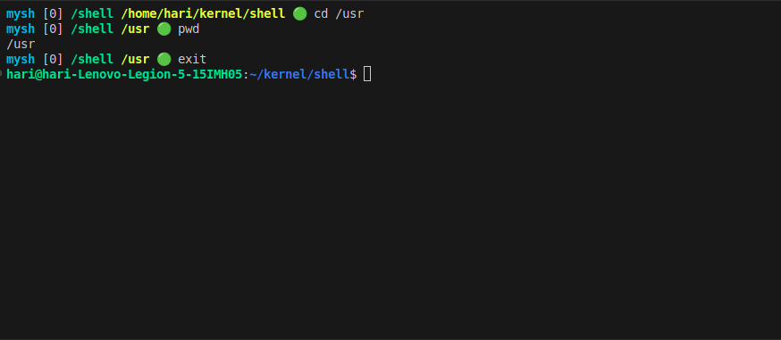
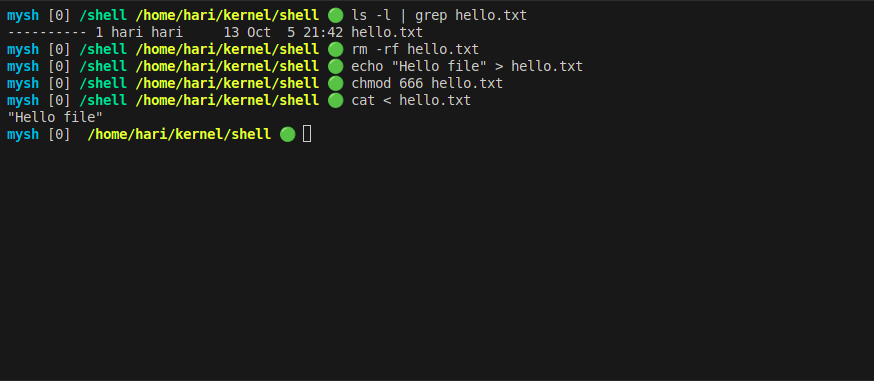
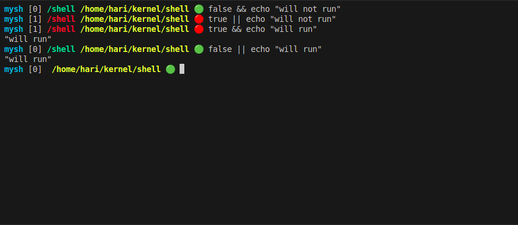
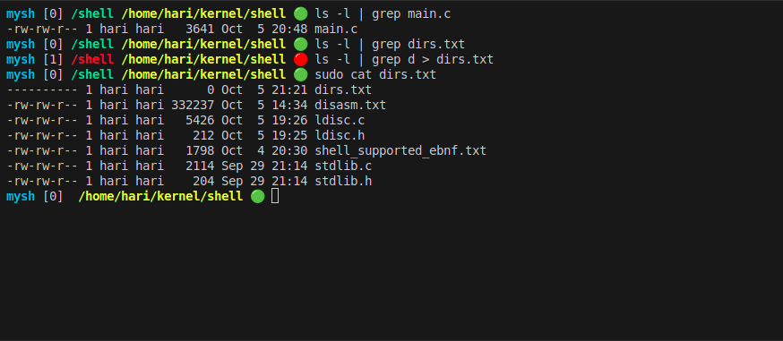
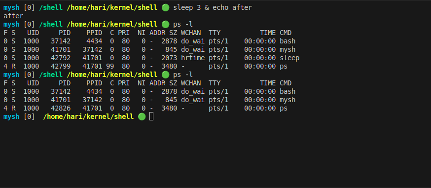
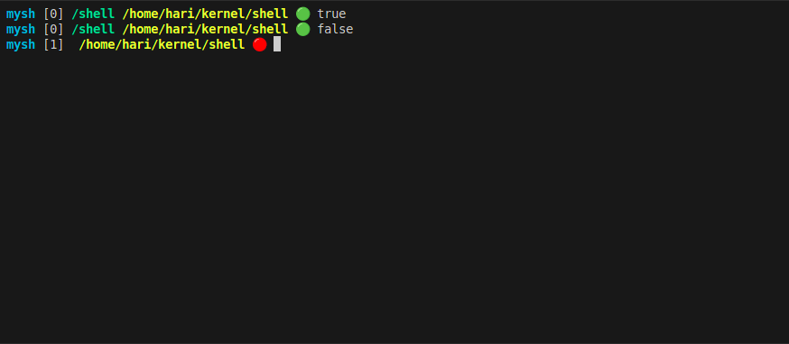
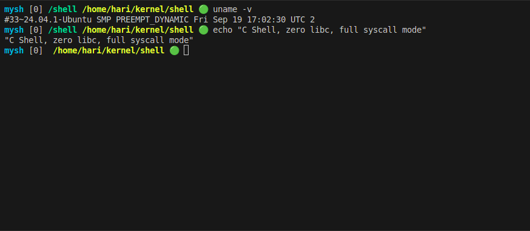

# mysh — A Minimal Standalone Shell (No libc, Syscalls Only)


🧠 Overview

mysh is a fully functional shell written **from scratch in C**,
using only raw Linux syscalls — no libc, no startup files.

It supports:
 - Command execution via execve()
 - Redirection: <, >, >>
 - Pipelines: |
 - Command lists: ;, &&, ||
 - Background jobs: &
 - Built-in commands: cd, exit, history
 - Command history and colorful prompt
 - Signal handling (SIGCHLD)
 - Written entirely in C with a hand-rolled parser/lexer


🧩 Directory Layout

lexer.c       → Lexical analyzer
parser.c      → Recursive descent parser for AST
execute.c     → Executes AST nodes via syscalls
syscall.c     → Inline assembly syscall wrappers
heap.c        → Simple bump allocator (no malloc)
map.c         → Hash map for environment/symbols
symtab.c      → Environment variable support
history.c     → Command history handling
ldisc.c       → Line discipline for input
print.c       → my_printf implementation
string.c      → Custom string manipulation
memory.c      → memset, memcpy, etc.
main.c        → Entry (_start) and main shell loop


⚙️ Build Command

gcc ctype.c execute.c heap.c history.c ldisc.c lexer.c main.c \
memory.c parser.c print.c stdlib.c string.c symtab.c syscall.c map.c \
-m64 -nostdlib -fno-pie -no-pie -Wl,-e,_start -static -g -o mysh

Notes:
 - `-nostdlib` removes libc startup code
 - `_start` is the true entry point
 - `-static` ensures no dynamic linking
 - Works on x86_64 Linux 5.x+
 - Not posix compilant, refer to shell_supported_ebnf.txt for current support

🧪 Demo Commands

Basic Commands and prompt

Builtins

IO Redirections

Logical operators

Pipe redirections

Sigchld

Smart prompt

Version



🧠 Prompt Design

mysh [<exit_code>] /current/directory $

Colors:
 - [0] → Green for success
 - [nonzero] → Red for failure
 - Cyan shell name, Yellow path


🧾 Architecture Flow

```
Input Line
   ↓
Lexer → Token Stream
   ↓
Parser → AST (Command / Pipeline / List)
   ↓
Executor → Syscalls (fork, dup2, execve, wait4)
   ↓
Output to terminal / files
```

💡 Internal Components

Lexer:
  Converts input into tokens (TOK_WORD, TOK_PIPE, TOK_REDIR, etc.)

Parser:
  Builds hierarchical AST using recursive descent.

Executor:
  Walks the AST, executes commands, sets up pipes/redirections.

Syscalls Used:
  fork, execve, pipe2, dup2, openat, wait4, rt_sigaction, exit

Memory:
  Custom bump allocator using sbrk-like logic.

Signals:
  Handles SIGCHLD to reap background jobs automatically.

Builtins:
  cd, exit, history handled internally (no fork).


🧑‍💻 Author

Hari Prasath K  
Firmware engineer and hobby OS developer.  
Passionate about Linux internals, syscalls, and anything building from scratch.


🧾 License

MIT License — Free for personal and educational use.

